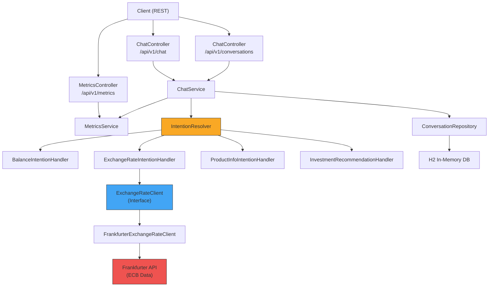
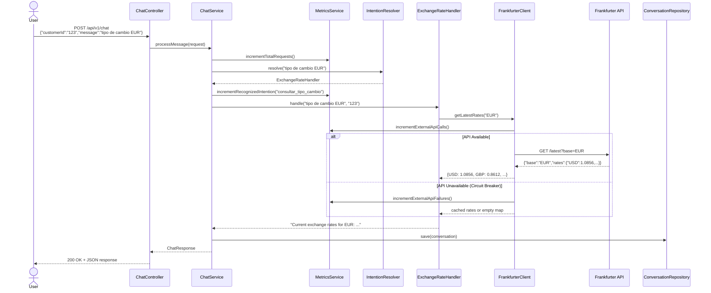
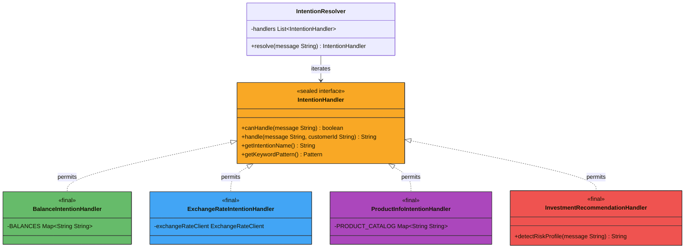
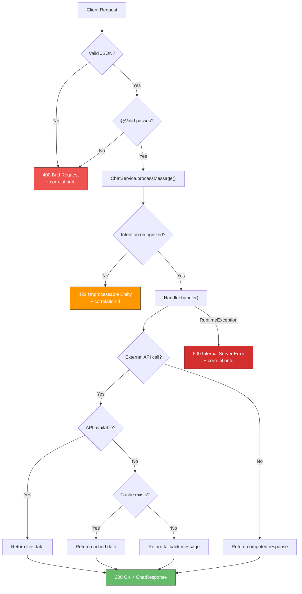
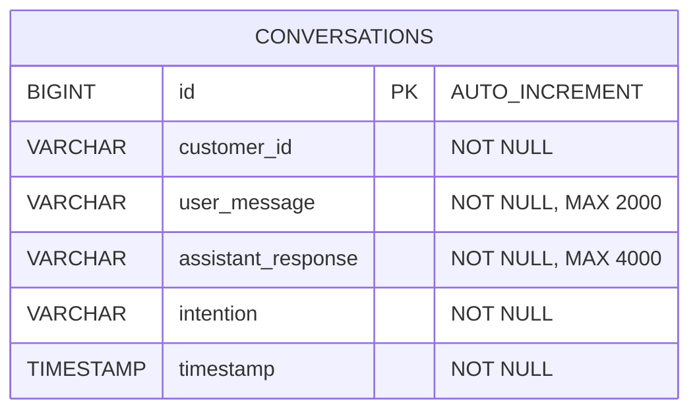

# Financial Virtual Assistant — Conversational Orchestrator Microservice

A Spring Boot 3.4 (Java 21) microservice that acts as the **conversational orchestrator** for a financial institution's virtual assistant. It receives natural-language customer queries, detects financial intentions using a **Strategy pattern** with **sealed interfaces**, queries real-time financial data from external APIs, and persists conversation history.

---

## Table of Contents

1. [Architecture](#architecture)
2. [Java 21 Features](#java-21-features)
3. [Component Diagram](#component-diagram)
4. [Sequence Diagram](#sequence-diagram)
5. [Class Hierarchy (Sealed Interface)](#class-hierarchy-sealed-interface)
6. [Error Handling Flow](#error-handling-flow)
7. [Database Schema](#database-schema)
8. [API Contracts](#api-contracts)
9. [Design Decisions](#design-decisions)
10. [Getting Started](#getting-started)
11. [Testing](#testing)
12. [Observability & Metrics](#observability--metrics)
13. [Scalability & Future Integrations](#scalability--future-integrations)
14. [File Index](#file-index)

---

## Architecture

The microservice follows a **layered architecture** with clear separation of concerns:

```
┌─────────────────────────────────────────────────────────────┐
│                    Presentation Layer                        │
│  ChatController  │  MetricsController  │  GlobalExcHandler   │
├─────────────────────────────────────────────────────────────┤
│                     Service Layer                            │
│        ChatService  │  MetricsService                        │
├─────────────────────────────────────────────────────────────┤
│                  Intention Layer (Strategy)                   │
│  IntentionResolver → [BalanceHandler, ExchangeRateHandler,   │
│                       ProductInfoHandler, InvestmentHandler]  │
│  ────── sealed IntentionHandler (Java 21) ──────             │
├─────────────────────────────────────────────────────────────┤
│               Data / Integration Layer                       │
│  ConversationRepository (JPA/H2)  │  ExchangeRateClient      │
│                                   │  (Frankfurter API)       │
└─────────────────────────────────────────────────────────────┘
```

**Key patterns applied:**
- **Strategy Pattern (sealed)** — Each financial intention is handled by a dedicated `IntentionHandler` implementation. The sealed interface (Java 21) makes the set of handlers explicit and compiler-enforced.
- **Open/Closed Principle** — New intentions are added by creating a new `final` class implementing `IntentionHandler` and adding it to the `permits` clause.
- **Circuit Breaker** — Simulated circuit breaker in `FrankfurterExchangeRateClient` with configurable failure threshold and automatic recovery.
- **Interface Segregation** — `ExchangeRateClient` interface decouples business logic from the specific API provider.

---

## Java 21 Features

This project leverages the following Java 21 language features and runtime capabilities:

| Feature | Where Applied | Benefit |
|---------|--------------|---------|
| **Sealed Interfaces** | `IntentionHandler` sealed with `permits` for 4 handlers | Compiler-enforced exhaustiveness; the set of intentions is explicit and type-safe |
| **Virtual Threads** | Enabled via `spring.threads.virtual.enabled=true` | Massive scalability for I/O-bound HTTP calls without thread pool exhaustion |
| **Pattern Matching for `switch`** | `InvestmentRecommendationHandler.detectRiskProfile()` | Cleaner, more readable control flow for risk profile classification |
| **Sequenced Collections** | `MetricsService.getMetricsSnapshot()` uses `LinkedHashMap` | Predictable, insertion-ordered metric output for dashboards |
| **Records** | All DTOs (`ChatRequest`, `ChatResponse`, `ErrorResponse`, `ExchangeRateResponse`) and `ExternalApiProperties` | Immutable, concise data carriers with zero boilerplate |
| **Text Blocks** | Investment recommendations, product catalog | Multi-line strings without concatenation noise |
| **`String.formatted()`** | All intention handlers | Instance method replacing `String.format()` for readability |

---

## Component Diagram



---

## Sequence Diagram

### Use Case: Exchange Rate Query



---

## Class Hierarchy (Sealed Interface)



> Adding a new intention requires: (1) create a `final` class implementing `IntentionHandler`, (2) add it to the `permits` clause, (3) annotate with `@Component`. The compiler enforces exhaustiveness.

---

## Error Handling Flow



---

## Database Schema



> The H2 in-memory database is used for development. For production, swap to PostgreSQL/MySQL by updating `application.yml` and adding the corresponding JDBC driver.

---

## API Contracts

### POST `/api/v1/chat`

Process a financial conversation message.

**Request:**
```json
{
    "customerId": "123",
    "message": "¿Cuál es el tipo de cambio del euro al dólar?"
}
```

**Response (200 OK):**
```json
{
    "customerId": "123",
    "intention": "consultar_tipo_cambio",
    "response": "Current exchange rates for EUR:\n  • 1 EUR = 1.0856 USD\n  • 1 EUR = 0.8612 GBP\nSource: Frankfurter API (European Central Bank data).",
    "timestamp": "2024-01-15T10:30:00"
}
```

**Error Response (422 Unprocessable Entity):**
```json
{
    "status": 422,
    "message": "I couldn't understand your financial query. Please try rephrasing...",
    "timestamp": "2024-01-15T10:30:00",
    "correlationId": "a1b2c3d4-e5f6-7890-abcd-ef1234567890"
}
```

**Error Response (400 Bad Request):**
```json
{
    "status": 400,
    "message": "Invalid request: message: must not be blank",
    "timestamp": "2024-01-15T10:30:00",
    "correlationId": "f1e2d3c4-b5a6-7890-1234-567890abcdef"
}
```

### GET `/api/v1/conversations/{customerId}`

Retrieve conversation history for a customer.

**Response (200 OK):**
```json
[
    {
        "id": 1,
        "customerId": "123",
        "userMessage": "What is my balance?",
        "assistantResponse": "Your current account balance is 15,420.75 USD...",
        "intention": "consultar_saldo",
        "timestamp": "2024-01-15T10:25:00"
    }
]
```

### GET `/api/v1/metrics`

Returns application operational metrics.

**Response (200 OK):**
```json
{
    "total_requests": 150,
    "recognized_intentions": 142,
    "unrecognized_intentions": 8,
    "external_api_calls": 45,
    "external_api_failures": 2,
    "intention_recognition_rate_percent": 94.67,
    "queries_by_intention": {
        "consultar_saldo": 60,
        "consultar_tipo_cambio": 45,
        "info_producto": 22,
        "recomendacion_inversion": 15
    }
}
```

---

## Design Decisions

| Decision | Rationale |
|----------|-----------|
| **Sealed Interface for Intentions (Java 21)** | Makes the set of intentions explicit and compiler-enforced. Enables exhaustive pattern matching in `switch` expressions. New handlers must be added to the `permits` clause, providing safety at compile time. |
| **Virtual Threads (Java 21)** | Eliminates thread pool bottlenecks for I/O-bound operations (HTTP calls, DB queries). Enabled globally via `spring.threads.virtual.enabled=true`. |
| **Pattern Matching for `switch` (Java 21)** | Cleaner control flow in risk profile detection and intention routing. Eliminates verbose if-else chains. |
| **Sequenced Collections (Java 21)** | `LinkedHashMap` as `SequencedMap` in metrics guarantees predictable JSON key ordering for monitoring dashboards. |
| **Unnamed Variables `_` (Java 21)** | Clarifies lambda intent when parameters are unused, reducing cognitive load. |
| **`String.formatted()` (Java 15+)** | Instance method replacing `String.format()` for improved readability and method chaining. |
| **`ExchangeRateClient` Interface** | Decouples from Frankfurter API. Swapping to XE or Oanda requires only a new implementation — no business logic changes. |
| **Simulated Circuit Breaker** | Prevents cascading failures when the exchange rate API is down. Configurable threshold and auto-recovery via `application.yml`. |
| **Java Records for DTOs** | Immutable, concise, and reduce boilerplate. Perfect for data transfer objects. |
| **`@ConfigurationProperties`** | Externalizes API URLs, timeouts, and circuit breaker settings. Environment-specific overrides without code changes. |
| **Correlation IDs in Errors** | Financial industry standard for incident tracking across distributed systems. |
| **H2 In-memory Database** | Rapid development without external dependencies. Easily swappable to PostgreSQL/MySQL for production. |
| **RestClient (Spring Boot 3.4)** | Modern synchronous HTTP client with fluent API. Benefits from virtual threads for concurrent calls. |
| **`@Order` on Handlers** | Controls evaluation priority. Balance checks before exchange rates prevents false positives on ambiguous messages. |

---

## Getting Started

### Prerequisites

- **Java 21+** (JDK)
- **Maven 3.8+**

### Build

```bash
mvn clean compile
```

### Run

```bash
mvn spring-boot:run
```

The service starts at `http://localhost:8080`.

### Quick Test with cURL

```bash
# Balance inquiry
curl -X POST http://localhost:8080/api/v1/chat \
  -H "Content-Type: application/json" \
  -d '{"customerId": "123", "message": "¿Cuál es mi saldo?"}'

# Exchange rate
curl -X POST http://localhost:8080/api/v1/chat \
  -H "Content-Type: application/json" \
  -d '{"customerId": "123", "message": "tipo de cambio del euro"}'

# Product info
curl -X POST http://localhost:8080/api/v1/chat \
  -H "Content-Type: application/json" \
  -d '{"customerId": "123", "message": "información sobre tarjeta de crédito"}'

# Investment recommendation
curl -X POST http://localhost:8080/api/v1/chat \
  -H "Content-Type: application/json" \
  -d '{"customerId": "123", "message": "recomendación de inversión conservador"}'

# Conversation history
curl http://localhost:8080/api/v1/conversations/123

# Metrics
curl http://localhost:8080/api/v1/metrics
```

### H2 Console

Available at `http://localhost:8080/h2-console` (JDBC URL: `jdbc:h2:mem:financial_assistant`).

---

## Testing

### Run all tests

```bash
mvn test
```

### Test Coverage Summary

| Test Class | Tests | Type | Coverage Target |
|-----------|-------|------|----------------|
| `ChatServiceTest` | 5 | Unit | Service orchestration, persistence, error handling, metrics |
| `ChatControllerTest` | 6 | Unit (MockMvc) | HTTP status codes, validation (400), error responses |
| `IntentionHandlerTest` | 18 | Unit | Keyword detection, response content for all 4 handlers |
| `FrankfurterExchangeRateClientTest` | 4 | Unit | API success, fallback, caching, circuit breaker |
| `MetricsServiceTest` | 10 | Unit | All counters, recognition rate, snapshot ordering |
| `IntentionResolverTest` | 4 | Unit | Handler resolution, priority, unrecognized exception |
| `MetricsControllerTest` | 1 | Unit (MockMvc) | Metrics endpoint JSON structure |
| `FinancialAssistantIntegrationTest` | 8 | Integration | Full-stack E2E: context, all intentions, persistence, metrics, validation |
| **Total** | **59** | | **Unit + Integration coverage** |

---

## Observability & Metrics

### Custom Metrics Endpoint

`GET /api/v1/metrics` provides:

**Technical metrics:**
- External API call count and failure rate
- Total request volume

**Functional metrics:**
- Queries by intention type (counters)
- Intention recognition success rate (%)

### Spring Actuator

`GET /actuator/health` — Application health status.

### Recommended Production Setup

In a production deployment, export these to **Prometheus + Grafana** via Micrometer:
- `financial_assistant_requests_total` — Counter
- `financial_assistant_external_api_errors_total` — Counter
- `financial_assistant_intention_recognized_total` — Counter by intention label
- `financial_assistant_chat_response_time_seconds` — Histogram

---

## Scalability & Future Integrations

### Horizontal Scaling

The microservice is **stateless by design**, enabling:

1. **Multiple instances** behind a load balancer (e.g., AWS ALB, Kubernetes Ingress).
2. **Swap H2 for PostgreSQL/MySQL** for shared persistent storage.
3. **Distributed cache (Redis)** for exchange rate caching — reduces external API calls and ensures all instances share cached data.
4. **Asynchronous processing (Kafka/RabbitMQ)** for long-running operations like loan simulations.
5. **Virtual threads (Java 21)** — Already enabled, providing massive I/O-bound scalability out of the box.

### Adding a New Intention

To add, for example, a `simular_prestamo` (loan simulation) intention:

1. Create `LoanSimulationHandler` as a `final` class implementing `IntentionHandler`
2. Add `LoanSimulationHandler` to the `permits` clause in `IntentionHandler`
3. Annotate with `@Component` and `@Order(5)`
4. Implement `canHandle()`, `handle()`, and `getIntentionName()`
5. **Done.** The `IntentionResolver` auto-discovers it. Zero changes to existing code.

### Changing the Exchange Rate Provider

To switch from Frankfurter to another provider (e.g., XE, Oanda):

1. Create `XeExchangeRateClient implements ExchangeRateClient`
2. Mark `FrankfurterExchangeRateClient` with `@ConditionalOnProperty` or use `@Profile`
3. Update `application.yml` with new provider's URL and credentials.

### Adding a New Data Provider

To integrate a stock market API (e.g., Alpha Vantage):

1. Create `StockMarketClient` interface + implementation (same pattern as `ExchangeRateClient`).
2. Create `StockPriceIntentionHandler` as a `final` class implementing `IntentionHandler`.
3. Add configuration in `application.yml`.
4. Register and deploy — all other components remain untouched.

### Security Considerations (JWT — Future)

To add JWT authentication:

1. Add `spring-boot-starter-security` and a JWT library (e.g., `jjwt`).
2. Create `JwtAuthenticationFilter` extending `OncePerRequestFilter`.
3. Configure `SecurityFilterChain` to protect endpoints.
4. The `/api/v1/conversations/{customerId}` endpoint should verify that the JWT subject matches the requested customer ID.

---

## File Index

| # | File | Purpose |
|---|------|---------| 
| 1 | `pom.xml` | Maven config with Spring Boot 3.4, Java 21, JPA, H2, Validation, Actuator |
| 2 | `src/main/resources/application.yml` | Externalized config: DB, API URLs, circuit breaker, timeouts, virtual threads |
| 3 | `src/main/java/.../FinancialAssistantApplication.java` | Spring Boot main class |
| 4 | `src/main/java/.../config/AppConfig.java` | RestClient bean with timeout configuration |
| 5 | `src/main/java/.../config/ExternalApiProperties.java` | `@ConfigurationProperties` for Frankfurter API |
| 6 | `src/main/java/.../model/Conversation.java` | JPA entity for conversation history |
| 7 | `src/main/java/.../dto/ChatRequest.java` | Input DTO (record) with validation |
| 8 | `src/main/java/.../dto/ChatResponse.java` | Output DTO (record) |
| 9 | `src/main/java/.../dto/ErrorResponse.java` | Standardized error DTO (record) with correlation ID |
| 10 | `src/main/java/.../intention/IntentionHandler.java` | **Sealed** strategy interface for intention handling |
| 11 | `src/main/java/.../intention/BalanceIntentionHandler.java` | Balance inquiry handler (`final`) |
| 12 | `src/main/java/.../intention/ExchangeRateIntentionHandler.java` | Exchange rate handler (`final`, Frankfurter API) |
| 13 | `src/main/java/.../intention/ProductInfoIntentionHandler.java` | Product info handler (`final`) |
| 14 | `src/main/java/.../intention/InvestmentRecommendationHandler.java` | Investment recommendation handler (`final`) |
| 15 | `src/main/java/.../intention/IntentionResolver.java` | Auto-discovers and resolves sealed handlers |
| 16 | `src/main/java/.../client/ExchangeRateClient.java` | Interface for exchange rate providers |
| 17 | `src/main/java/.../client/ExchangeRateResponse.java` | Frankfurter API response DTO (record) |
| 18 | `src/main/java/.../client/FrankfurterExchangeRateClient.java` | Frankfurter implementation with circuit breaker |
| 19 | `src/main/java/.../repository/ConversationRepository.java` | JPA repository |
| 20 | `src/main/java/.../service/ChatService.java` | Core orchestration service |
| 21 | `src/main/java/.../service/MetricsService.java` | Metrics tracking with sequenced collections |
| 22 | `src/main/java/.../controller/ChatController.java` | REST controller for chat and history |
| 23 | `src/main/java/.../controller/MetricsController.java` | REST controller for metrics |
| 24 | `src/main/java/.../exception/UnrecognizedIntentionException.java` | Custom exception |
| 25 | `src/main/java/.../exception/ExternalApiException.java` | Custom exception |
| 26 | `src/main/java/.../exception/GlobalExceptionHandler.java` | `@ControllerAdvice` error handler |
| 27 | `src/test/java/.../service/ChatServiceTest.java` | Service layer unit tests (5) |
| 28 | `src/test/java/.../service/MetricsServiceTest.java` | Metrics service unit tests (10) |
| 29 | `src/test/java/.../controller/ChatControllerTest.java` | Controller unit tests (6) |
| 30 | `src/test/java/.../controller/MetricsControllerTest.java` | Metrics controller unit test (1) |
| 31 | `src/test/java/.../intention/IntentionHandlerTest.java` | Intention handler unit tests (18) |
| 32 | `src/test/java/.../intention/IntentionResolverTest.java` | Intention resolver unit tests (4) |
| 33 | `src/test/java/.../client/FrankfurterExchangeRateClientTest.java` | API client unit tests (4) |
| 34 | `src/test/java/.../FinancialAssistantIntegrationTest.java` | Full-stack integration tests (8) |

---

## Checklist

- [X] API REST designed and justified in README.
- [X] Endpoint POST /api/v1/chat implemented.
- [X] Strategy pattern for intention processing (sealed interface, Java 21).
- [X] Handlers: balance, exchange rate, product info, investment recommendation.
- [X] Frankfurter API integration encapsulated in dedicated client.
- [X] External API failure handling (fallback + circuit breaker).
- [X] H2 persistence with Conversation entity and JPA repository.
- [X] Global exception handler with @ControllerAdvice.
- [X] Unit + integration tests (59 tests: 51 unit + 8 integration).
- [X] README with architecture, contracts, design decisions, Mermaid diagrams.
- [X] Endpoint /metrics with operational metrics.
- [X] Virtual threads enabled (Java 21).
- [X] JWT security (documented as future integration path in [§ Security Considerations](#security-considerations-jwt--future)).
- [X] Scalability and future integration explanation in README.
